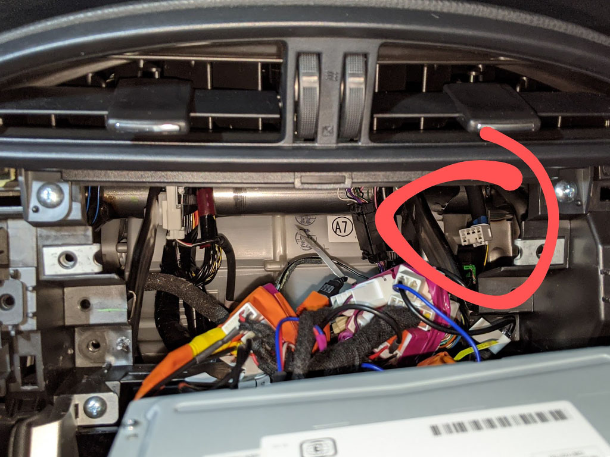
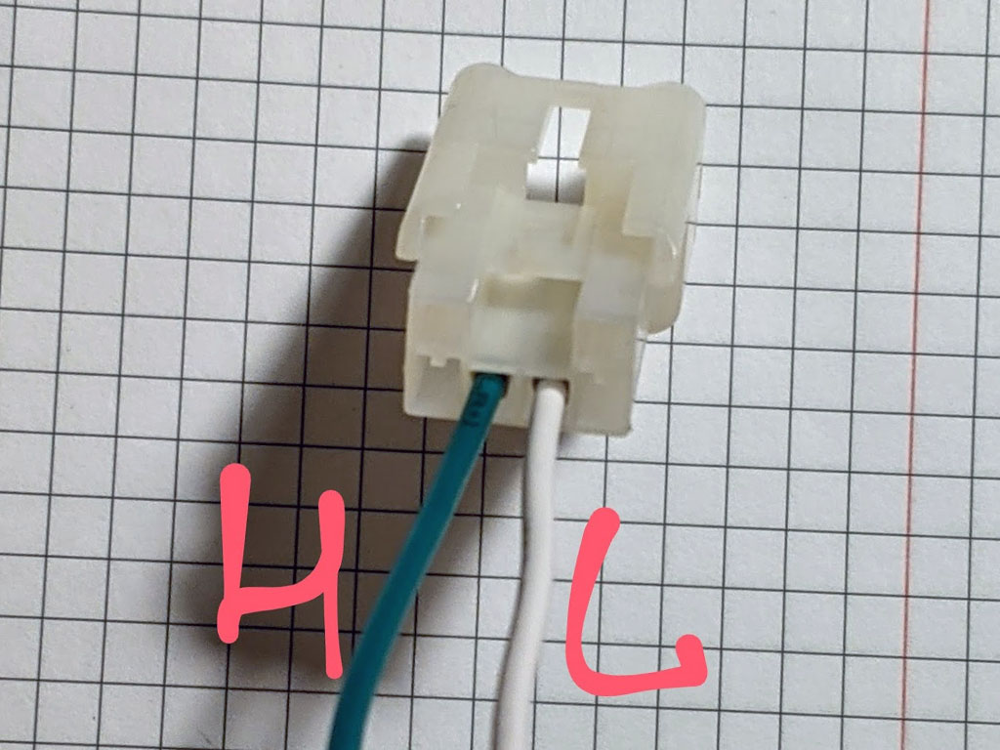

# CAN bus (2013-2020 model years)

## Connections

Besides the CAN pins in the OBD-II port, there is a CAN bus male port hidden
behind the car multimedia head unit:

It's very close to the glovebox, which makes it great for putting your CAN
reader in the glovebox. Such a placement makes sure it's out of the way and you
won't accidentally hit it with your leg while on the track, and also allows
quick access for troubleshooting and experimenting. There's also a second 12V
port inside the glovebox, which makes it easy to use a 12V-to-USB adapter
instead of adding a 12V-to-5V converter to your hardware design.

You can use the two middle pins of a
[Toyota radio harness](https://www.amazon.com/gp/product/B0002BEQJ8)
to connect to the CAN bus in a reliable way.

It's recommended to use a ~60–90 cm (2–3') twisted pair cable between that port
and your CAN reader.

## Details on some CAN IDs

### CAN ID 0x18 (24)

Update frequency: 100 times per second.

`0x18` is a strange CAN ID. Judging by the low CAN ID number (which in CAN networks
implies higher priority) and the high update frequency, one would expect it to
have some important data, like data for ABS or ESC systems. But based on what is
currently known, it only has one the steering angle as a useful data channel.
The steering angle graphs are usually relatively smooth, and this data is also
available over `0xD0`, along with some much more important data, such as
accelerometers.

Channel name | Equation | Notes
------------ | -------- | -----
Steering angle | `bytesToIntLe(raw, 0, 2) * 0.1` | Also available in `0xD0`
??? | `C` or `bytesToIntLe(raw, 2, 1)` | The value is 112 most of the time for me
??? | `D` or `bytesToIntLe(raw, 3, 1)` | 0–14 sawtooth
??? | `E` or `bytesToIntLe(raw, 4, 1)` | The value is 0 most of the time for me
??? | `F` or `bytesToIntLe(raw, 5, 1)` | The value is 0 most of the time for me
??? | `G` or `bytesToIntLe(raw, 6, 1)` | The value is 0 most of the time for me
??? | `H` or `bytesToIntLe(raw, 7, 1)` | Strange data channel. It changes in a strange way when the car turns. It also has a 0-14 sawtooth over some otherwise smooth curve.

### CAN ID 0xD0 (208)

Update frequency: 50 times per second.

Channel name | Equation | Notes
------------ | -------- | -----
Steering angle | `bytesToIntLe(raw, 0, 2) * -0.1` | Positive value = turning left. You can add a `-` if you prefer it the other way around. Also available in `0x18`.
Yaw rate | `bytesToIntLe(raw, 2, 2) * -0.286478897` | The multiplier for º/sec appears to be ((90 / pi) * 100). Or is this "yaw rate"?..
??? | `E` | Some flags?
??? | `F` | Some flags?
Lateral acceleration | `bytesToIntLe(raw, 6, 1) * 0.2` |
Longitudinal acceleration | `bytesToIntLe(raw, 7, 1) * -0.1` |
Combined acceleration | `sqrt(pow2(bytesToIntLe(raw, 6, 1) * 0.2) + pow2(bytesToIntLe(raw, 7, 1) * 0.1))` |

### CAN ID 0xD1 (209)

Update frequency: 50 times per second.
Length: 4 bytes

Channel name | Equation | Notes
------------ | -------- | -----
Speed | `bytesToIntLe(raw, 0, 2) * 0.015694` | May want to check the multiplier against an external GPS device
Brake position | `min(C / 0.7, 100)` | The third byte is the pressure in the brake system, in Bars. The 0.7 divider seems to be a good value to get 100% at pressure slightly higher than those you're likely to use on the track for cars with no aero. You can use 0.8 or 0.9 if you see 100% too often.
??? | D | Always 0?

### CAN ID 0xD4 (212)

Update frequency: 50 times per second.

Channel name | Equation | Notes
------------ | -------- | -----
Wheel speed FL | `bytesToIntLe(raw, 0, 2) * 0.015694` | Use same multiplier as for speed in 0xD1
Wheel speed FR | `bytesToIntLe(raw, 2, 2) * 0.015694` | Use same multiplier as for speed in 0xD1
Wheel speed RL | `bytesToIntLe(raw, 4, 2) * 0.015694` | Use same multiplier as for speed in 0xD1
Wheel speed RR | `bytesToIntLe(raw, 6, 2) * 0.015694` | Use same multiplier as for speed in 0xD1

### CAN ID 0x140 (320)

Update frequency: 100 times per second.

Channel name | Equation | Notes
------------ | -------- | -----
Accelerator position | `A / 2.55`
Clutch position | `(B & 0x80) / 1.28` | On/off only
??? | B & 0x70 | Unused?
??? | B & 0x0f | 0–15 counter?
Engine RPM | `bitsToUIntLe(raw, 16, 14)`
??? | `D & 0x80` | Always 0?
??? | `D & 0x40` | 1 when accelerator pedal is released, 0 otherwise
Accelerator position | `E / 2.55` | Not clear what's the difference from the other two
Accelerator position | `F / 2.55` | Not clear what's the difference from the other two
Throttle position | `G / 2.55` | Not tested
??? | H | Some flags

### CAN ID 0x141 (321)

Update frequency: 100 times per second.

Channel name | Equation | Notes
------------ | -------- | -----
Accelerator pedal position? | `bytesToIntLe(raw, 0, 2)` | Follows `A` from `0x140` closely with ~9860 for 0% and ~11625 for 42%. Needs more testing.
Engine load? | `bytesToIntLe(raw, 2, 2)` | Follows the data from OBD-II PIDs 0x4 and 0x43 pretty well.
Engine RPM | `bitsToUIntLe(raw, 32, 14)`
??? | `F & 0x80` | 1 when accelerator pedal is released, 0 otherwise
??? | `F & 0x40` | Always 0?
Gear | `(G & 0xf) * (1 - (min(G & 0xf, 7)) / 7)` | It's basically just `G & 0xf` but neutral is reported as `7`, hence the complex math to turn it into a 0. The reverse gear is reported as `1`. The value can be wrong when the clutch pedal is depressed.
??? | `G & 0xF0` | I saw values of 128, 160, 192 here.
??? | `H` | Equals to 16 when I lift off the accelerator, then turns to 8, then 0.

### CAN ID 0x144 (324)

Update frequency: 50 times per second.

Channel name | Equation | Notes
------------ | -------- | -----
Brake pedal pressed | `(G & 8) / 8` |

### CAN ID 0x152 (338)

Update frequency: 50 times per second.

Channel name | Equation | Notes
------------ | -------- | -----
Hand brake on | `(G & 8) / 8` |
Brake pedal pressed | `(G & 16) / 16` |

### CAN ID 0x282 (642)

Update frequency: ~16 times per second.

Channel name | Equation | Notes
------------ | -------- | -----
Seatbelt plugged in | `(F & 1) == 0` | Only tested driver's side seatbelt. Passenger side might use a different flag or the same flag.

### CAN ID 0x360 (864)

Update frequency: 20 times per second.

Channel name | Equation | Notes
------------ | -------- | -----
Engine oil temperature | `C - 40`
Coolant temperature | `D - 40`
Cruise control ON | `(F & 16) / 16` | Means the mode is "On", but not necessarily "Set". Not tested much.
Cruise control set | `(F & 32) / 32` | Not tested much.
Cruise control speed | `H` | In the same unit as the current speed display units? Not tested much.

### CAN ID 0x361 (865)

Update frequency: 20 times per second.

Channel name | Equation | Notes
------------ | -------- | -----
Gear | A & 0x7 | Not tested

### CAN ID 0x374 (884)

Update frequency: 1 time per second.

Channel name | Equation | Notes
------------ | -------- | -----
Driver's door open | `D & 1` | Tested on a RHD car. The equation for driver and passenger door open might be swapped for LHD cars.
Passenger's door open | `(D & 2) / 2` | Tested on a RHD car. The equation for passenger and driver door open might be swapped for LHD cars.
Fog lights on | `(B & 128) / 128` | Flag is only set when the main lights are on (parking or full).
Boot open | `(D & 32) / 32` |

### CAN ID 0x375 (885)

Update frequency: 1 time per second.

Channel name | Equation | Notes
------------ | -------- | -----
Driver's door open | `B & 1` | Tested on a RHD car. The equation for driver and passenger door open might be swapped for LHD cars.
Passenger's door open | `(B & 2) / 2` | Tested on a RHD car. The equation for passenger and driver door open might be swapped for LHD cars.
Boot open | `(B & 32) / 32` |
Either door open | `(D & 4) / 4` | Only flagged when either door is open. Not flagged for the boot.
Lights on | `(D & 8) / 8` | Flag is set for both parking lights and full lights.

### Would be nice to find CAN IDs for ...

TODO: would be great to find how to read the ambient temperature, and maybe the
intake temperature.

TODO: find how to log the fuel remaining.

### Typical histogram of CAN IDs

Here's what the distribution of CAN IDs looks like in the CAN bus while idling in a
parking lot:

 CAN ID (hex) | CAN ID (decimal) | Number of packets received over a 10 second period
---- | --- | ---
0x18 | 24  | 1000
0xD0 | 208 | 500
0xD1 | 209 | 500
0xD2 | 210 | 500
0xD3 | 211 | 500
0xD4 | 212 | 500
0x140 | 320 | 1000
0x141 | 321 | 1000
0x142 | 322 | 1000
0x144 | 324 | 500
0x152 | 338 | 500
0x156 | 342 | 500
0x280 | 640 | 500
0x282 | 642 | 167
0x284 | 644 | 100
0x360 | 864 | 200
0x361 | 865 | 200
0x370 | 880 | 200
0x372 | 882 | 100
0x374 | 884 | 10
0x375 | 885 | 10
0x37A | 890 | 10
0x3D1 | 977 | 84
0x440 | 1088 | 25
0x442 | 1090 | 25
0x44D | 1101 | 25
0x46C | 1132 | 25
0x4C1 | 1217 | 10
0x4C3 | 1219 | 10
0x4C6 | 1222 | 10
0x4C8 | 1224 | 10
0x4DC | 1244 | 10
0x4DD | 1245 | 10
0x63B | 1595 | 20
0x6E1 | 1761 | 10
0x6E2 | 1762 | 10
